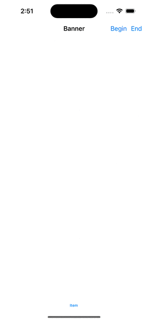

 

#  "Just Another Banner"

## Purpose

JABanner is intended to be a simple, flexible and re-usable framework for implementing custom refresh controls (and eventually sticky headers) in `UIScrollView`s



## Why?

I spend more than a working week exploring other libraries and blog posts while looking for a simple way to customise a refresh control for a project I was working on.

While there are some really awesome “examples”, none provided a workable solution which was abstract enough to be usable (or usable in way which I felt comfortable introducing into my projects) and many were simply out-of-date (I didn’t find one which worked well with the iPhone X)

# Philosophy

The library has been designed with re-use in mind, with the intention that a single project may use a number of different refresh controls (or sticky headers) on any number of different views.

With this in mind, the library has been designed:
* Not to use inheritance.  This means the library does not extend `UIScrollView`.  This is intentional for a number of reasons.  This prevents the need to have to provide customised versions of classes like `UITableView` and `UICollectionView`, which could seriously compromise the design of other projects
* Not to use `extension`s.  This is personal choice, but it means that there are no “extra” functions exposed on other `UIScrollView` based classes, which might otherwise complicate development or possibly compromise other classes.  It also means that it becomes a deliberate, conscious decision on the part of the developer to make use of the library, which could make it easier to diagnose issues.
* Not using the `UIScrollViewDelegate`, as this could break the implementing class.  Instead, the API makes use KVO and monitors key properties of the `UIScrollView` in order to perform it's operations

## Usage

Simply create an strong instance of the `BannerController`, assign a `RefreshableController` to it and install it onto the desired `UIScrollView`

````
let bannerController: BannerController = BannerController()
bannerController.refreshController = RefreshController() // Supplied by you
bannerController.install(on: tableView)
````

To make the API as abstract as possible, the API exposes a simple `protocol`

````
public protocol RefreshableController: ExpandableController {
  var view: UIView { get }
  var desiredHeight: CGFloat { get }

  func beginRefreshing()
  func endRefreshing()
}
````
This provides a number of imporant properties

* `view` is the actual view you want to display, this is added to the `UIScrollView`
* `desiredHeight`. I was aiming to have as much support from autolayout as possible, but I haven't gotten to that yet, so instead the implementation needs to provide the `desriedHeight` hint, which dictates the “expaned” height of the control.  The API won’t call `beginRefreshing` until the user has pulled the `UIScrollView` down past this point
* `beginRefreshing`. Notifies the implementation that a “refresh” has been “triggered”.  This may occur because the code has called `beginRefresh` on the `BannerController` or because the user pulled the `UIScrollView` down beyond the `desiredHeight` of the view
* `endRefreshing`. Notifies the implementation that a "refresh" has finished.  This will collapse the view.  This is triggered by the code calling `endRefreshing` on the `BannerController`

In additional, the `RefreshableController` also conforms to the `ExpandableController` `protocol`

```
public protocol ExpandableController {
    func expanded(by delta: CGFloat)
}
````
This provides feedback to the implementation about the expansion of the view, based on a percentage of the `desiredHeight`.  This provides implementations an opportunity to provide some animation effects or other tasks which might be related to how they want to display/update the control

# Why the awesome name

Yeah, I know, exciting isn't it.  I see a lot of really cool libraries about doing simular things, many times I find myself just wanting to experiement with the idea or make my own "enchancements", which leads to "Just Another ... library"

I did toy with the idea of calling it Hulk or Gamma, after Dr Banner, but thought that might just be a little to obscure for most people
